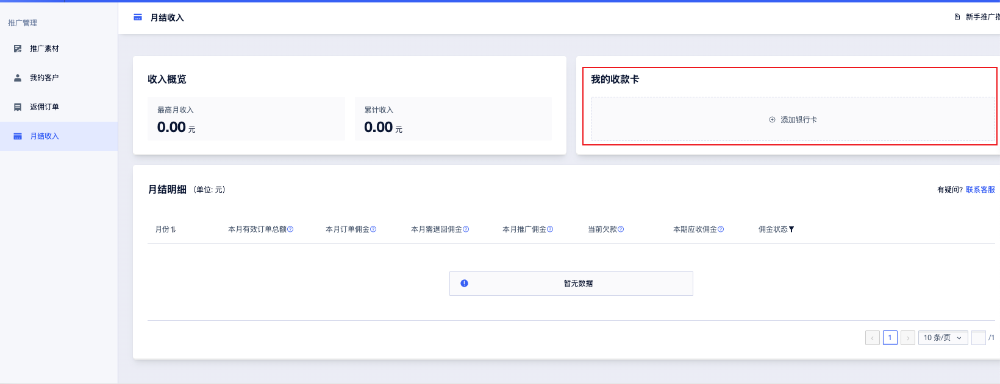
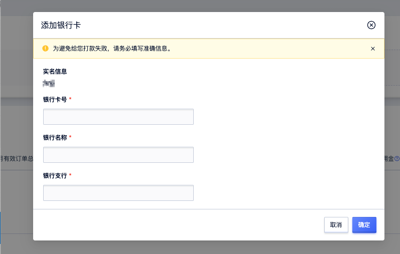
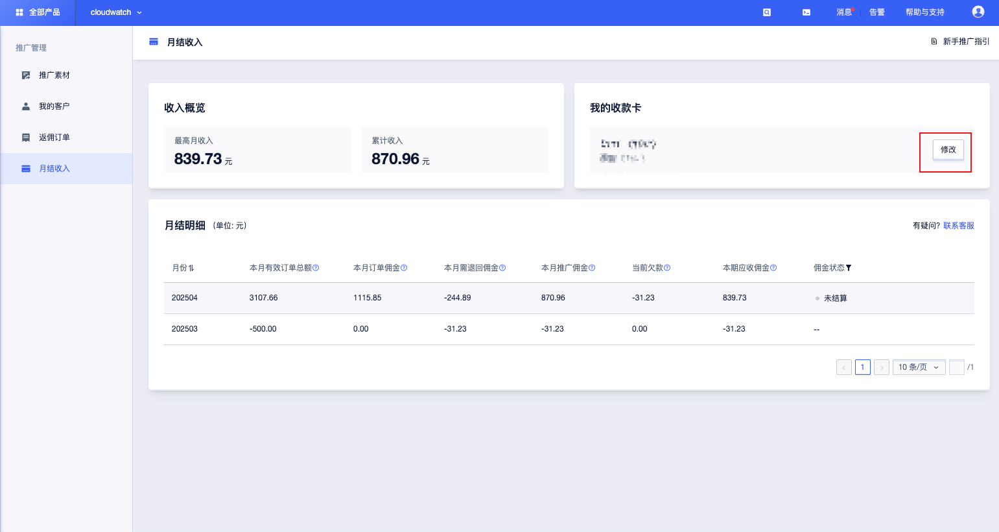
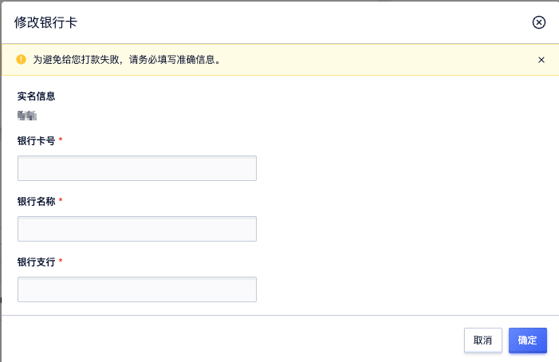
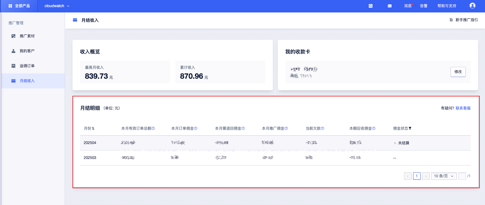

## 月结收入  
您可在本页面查看您的收入概览、绑定银行卡、查看月结明细。  

### 佣金计算规则  
- 计算公式：本期应收佣金 = 本月推广佣金（本月有效订单佣金 - 本月退回佣金） - 历史欠款  
- 提现条件：累计佣金 ≥ 50 元时触发打款，未达标金额累计至下月。  
- 负值处理：若本期佣金为负数，将自动计入下月“当前欠款”。  

### 收入概览
您可在此查看您最高的月收入以及累计收入

### 绑定银行卡  
1. 点击 【添加银行卡】 
2. 输入以下信息：  
   - 银行卡号  
   - 银行名称  
   - 银行支行  

### 修改银行卡  
1. 点击 【修改】  
2. 输入以下信息：  
   - 银行卡号  
   - 银行名称  
   - 银行支行

### 月结明细
您可在此查看月结佣金的明细，以及佣金状态

