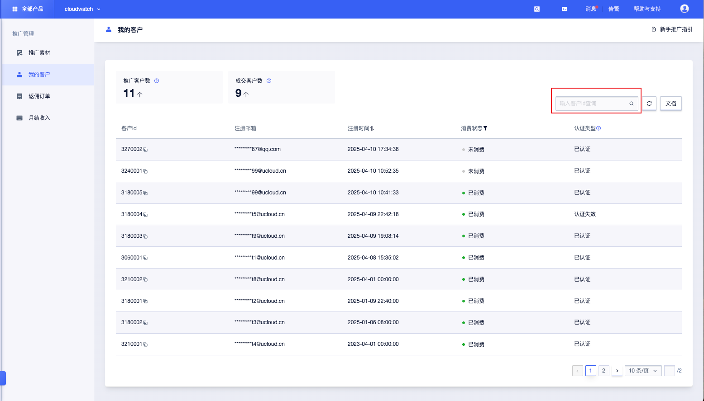

## 我的客户  
您可通过本页面查看您所关联的客户信息、注册时间、消费状态、认证类型。 

### 客户数量说明
- 推广客户数  ：通过 UCloud 推广者的邀请链接首次注册 UCloud 账户，即可计入推广客户数。
- 成交客户数  ：通过推荐者的邀请链接注册 UCloud 账户，并在注册90日内购买指定范围内产品的用户，即可计入成交客户数。  

### 查询客户
输入客户ID查询对应客户信息

**重要提示**：  当认证类型为无效认证或未认证的客户，其消费订单无法计算返佣，属于无效订单。  
