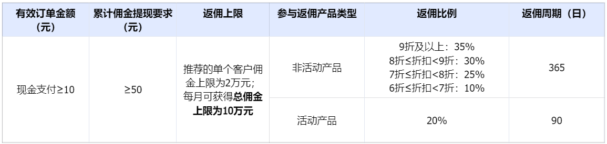
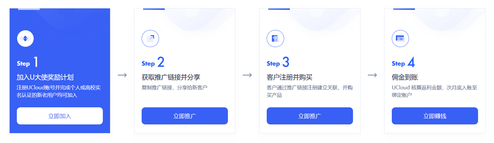
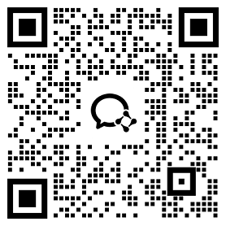

# 返利规则

新用户通过点击U大使的邀请链接注册UCloud账户，并在注册90日内购买指定范围内的产品，UCloud 将按照新用户返佣周期内的订单以约定奖励比例进行现金奖励，佣金、赠金等其他奖励仅限发放于本人账号中。

**现金奖励费用（含税）**= 90日内活动产品订单金额 x 20% + 365日内非活动产品订单金额 x 对应返佣比例

**新用户定义**：

1. 必须是首次注册用户，并在注册 90 日内购买指定范围内产品的用户；

2. 未与 UCloud 销售人员、合作伙伴以及渠道代理商有接洽的用户；

3. 与推荐者视为非同一用户，指基于不同 UCloud 账号在注册、登录、使用中的关联信息不得为同一人（关联信息举例：同一证件、同一手机号、同一支付账号、同一设备、同一地址等）；

4. 新用户与推荐者不可关联 UCloud 企业。

**活动产品&非活动产品定义**：

1. 活动产品：指官网“活动”导航栏下参与活动的产品；

2. 非活动产品：指其他所有除了官网活动外的产品，例如通过商务折扣、或者控制台直接购买的产品。

**返佣周期定义**：

1. 活动产品返佣周期：U大使推荐的新用户在首次消费日起90日内的预付费订单（时付/月付/年付）现金支付总金额（新购、续费订单均返）；

2. 非活动产品返佣周期：U大使推荐的新用户在首次消费日起365日内的预付费订单（时付/月付/年付）现金支付总金额（新购、续费订单均返）。
   

## 一、U大使申请资格界定

1. UCloud 账号**个人实名认证和高校实名认证**的用户，企业认证用户暂不支持；
2. UCloud（前）员工及其家属、与UCloud有合作关系的销售工作人员及代理商，不可成为U大使。

## 二、客户关联
关联方式：新客户通过U大使邀请链接进行注册购买，若未通过该链接进行注册，U大使可在<a href="https://console.ucloud.cn/cps-platform/clientlist/manuallylink" target="_blank">推广后台发起客户关联申请</a>（注：不支持跨月申请，如被推荐者注册时间为2026/01/01，关联客户申请需在2026年1月内完成）

## 三、推广返佣范围

**1. 推广返佣产品**

**计算**：轻量云主机(奔流型轻量云主机不返利)、快杰云主机、裸金属云主机、容器云、私有专区资源块、虚拟机、通用计算；

**AI 类相关**：GPU 云主机、大模型平台；

**网络**：弹性IP、共享带宽、负载均衡、带宽包、UDPN、UGN、UWAN、PathX、域名要素引擎、网络质量监控、AnycastEIP；

**存储**：云硬盘、云硬盘 UDisk-SSD、UDisk-RSSD；

**数据库**：云数据库、云数据库-分布式、云内存 UMem Redis、云内存 UMem Memcache、容量型KV存储、TiDB；

**安全**：堡垒机、数据库审计、UWAF、旗舰版web漏洞扫描、SSL证书、华东高防、海外高防、加密服务、高防清洗、主机入侵检测；

**数据分析**：UHadoop、UKafka、数据仓库、弹性搜索。

**2. 不返佣情况**

1）U大使注销UCloud账号，等同于注销U大使账号，不再拥有返佣资格；

2）U大使存在与被推荐购买者存在协作者关系，或者如下风控信息记录（例如：同手机号、同注册邮箱、同身份证、同注册/登录ip等同人风控记录），则产生的即为无效订单，不予返佣；

3）若被推荐者首单距注册超过90天：首日订单日 > 注册时间 + 90天，不予返佣；

4）推荐用户购买产品不在指定产品范围内（产品列表请见第1条），不予返佣；

5）推荐用户按量或后付费订单，不予返佣；

6）推荐用户发生退款的订单，不予返佣；

7）若推荐用户存在商务折扣，商务折扣6折以下不返佣。

8）若推荐客户业务存在违规，或其他特殊违规情况，不予返利。

## 四、推广流程

## 五、推广佣金到账

**1. 返佣计算**

现金奖励费用（含税）= 90日内活动产品订单金额 x 20% + 365日内非活动产品订单金额 x 对应返佣比例

（有效订单金额指现金支付，不包括赠送金额/代金券支付金额），UCloud根据国家税法规定，依法为U大使代扣代缴的税费。

**佣金结算按照自然月计算，即每月初计算上月所有在返佣周期（订单周期）内的返佣订单。**

举例：若新客户首购订单是4月18日，

则在5月初计算该客户4月18日至4月30日的订单（13个自然日），并在5月底发放该笔佣金；

在6月初计算该客户5月份的订单（31个自然日），并在6月底发放该笔佣金；

在7月初计算该客户6月份的订单（30个自然日），并在7月底发放该笔佣金；

在8月初计算该客户7月1日至7月16日内的订单（16个自然日），并在8月底发放该笔佣金；

针对活动产品订单共计90个自然日，非活动产品订单同样采用如上计算方法，将计算周期拉长至365个自然日。

**2. 到账时间**

奖励金额到账方式为UCloud财务系统统一支付打款，佣金会在结算当月月底转入U大使的银行账号。如遇特殊情况，支付时间会有所延迟，请务必提供正确的银行相关信息。

**3. 佣金上限**

U大使推荐单个用户佣金上限为2万元，每月可获得总佣金上限为10万元，U大使佣金累计超过50元即可发放。

**4. 佣金税费**

佣金金额为实际收入金额，UCloud将为U大使负担缴纳税款（如有）。

**5. 佣金扣除**

被推荐的新用户如果删除退费，U大使将无法获取奖励 。如UCloud已经向U大使支付了相关费用的，UCloud有权从应支付U大使的下次推荐费用中直接扣收，扣收不足的，U大使应当在UCloud通知之日起5日内退还扣收不足部分的款项。

 

 扫码进专属群获取最新活动及优惠   

